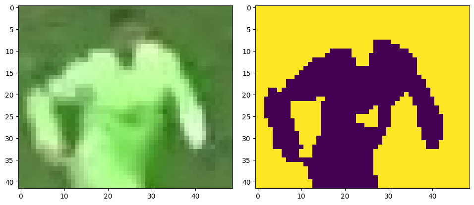

# Football Analytics with Computer Vision ⚽️🦾
This repository implements a Computer Vision pipeline that annotates football videos. 

## Pipeline
* [ultralytics YOLOv5XL](https://github.com/ultralytics/yolov5) was fine-tuned with the [roboflow football-players-detection Image Dataset](https://github.com/ultralytics/yolov5). Check notebook `training/football_training_yolov5.ipynb`.
* A byte tracker was implemented in order to track players, referees, and the ball across frames.
* KMeans was used to cluster pixels, and segment players from the pitch in order to assign them to a team.
  
The cluster centroid for the jersey is then used to determine which team the player belongs to.

## How to run
### Fine-tune YOLOv5
* Run `training/football_training_yolov5.ipynb` in a Google Colab GPU runtime.
* Download `best.pt` and put it in a directory called `models` inside the project directory.
### Inference
* Use `Python 3.x`
* Create a virtual environment and activate it:
  * `python3 -m venv venv`
  * `source venv/bin/activate`
* Install the dependencies:
  * `pip install -r requiremets.txt`
* Put your desired input video in `input_videos`.
* Run `main.py`:
  * `python3 main.py`
* Don't forget to update the video path in `main.py`, also make sure to update the stub name to save the object trackers output for future runs.

## Currently working on
* Improving object tracking
* Adding support for analytics such as ball posession percentage, and distance covered by players.

## Credits
The presented methods are inspired by [ABdullah Tarek](http://www.youtube.com/@codeinajiffy)'s work.